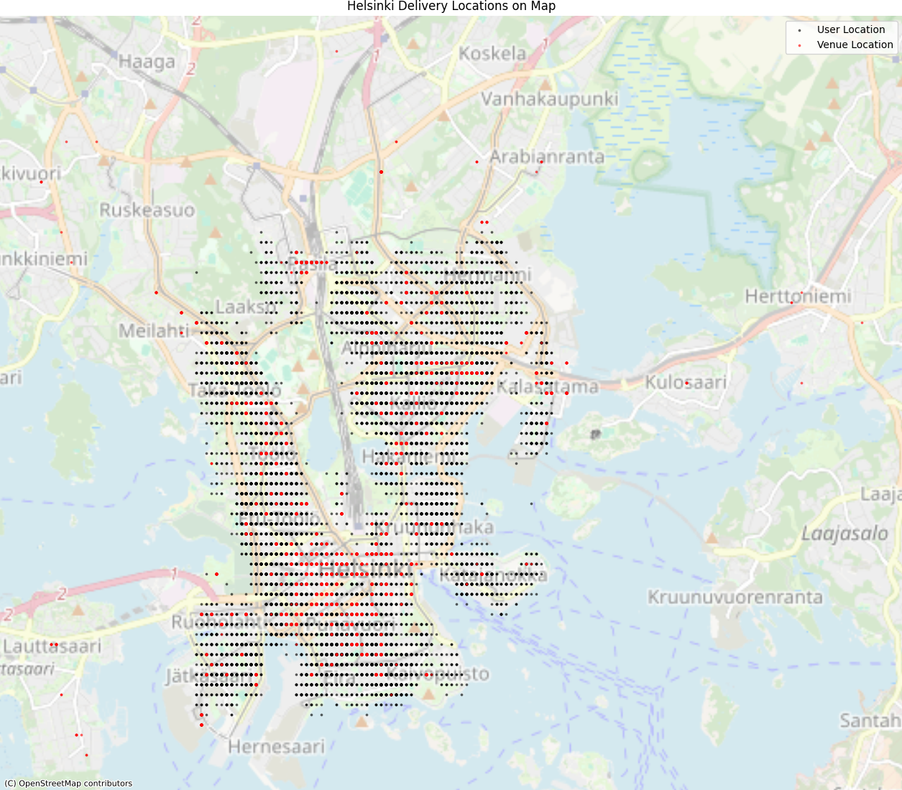
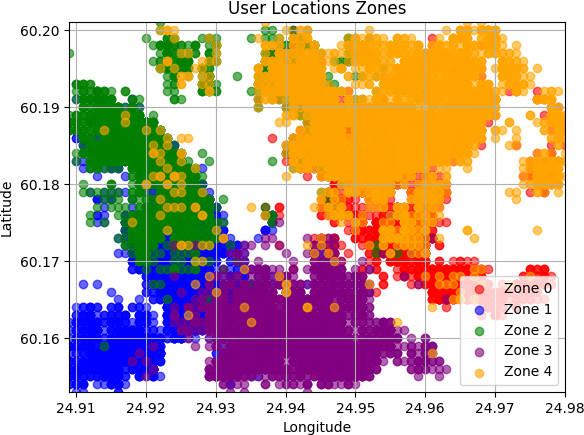
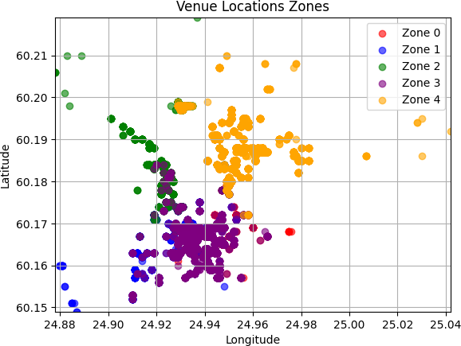
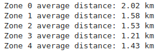
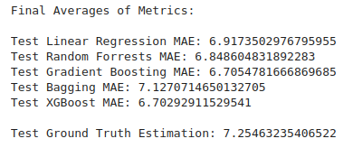

# Wolt_delivery_orders
What can we do with spatio-temporal data from delivery orders ? The project is based on publicly available data from the delivery company Wolt. Find the data [here](https://raw.githubusercontent.com/woltapp/applied-science-internship-2025/refs/heads/main/orders_autumn_2020.csv).

The data is from 2020 in Helsinki. See the users (black) and the venues (red) on the map of Helsinki:

 
*Users and Venues locations on the map*

## Are users and venues related ?

Yes! They seem to be related based on distance, as the visual below suggests. We can also verify this with subsequent distance analysis after obtaining the clusters.

 
*Users clusters*
 

 
*Venue clusters*

We cluster the 4D point cloud of the vectors (user longitude, user latitude, venue longitude, venue latitude), so it accounts for user-venue connections! Then we project all the 4D points in their user-plane or venue-plane and color each projection according to the initial cluster it belongs to. The fact that the two projections appear to be well clustered on their 2D planes and that they also match, shows the importance of distance in the orders.

We can look further for intra-cluster and inter-cluster distance averages of orders for more insights!

 
*Intra-cluster mean distances*

## Can we improve the accuracy of the delivery time ?

Yes! With an XGBoost model we can achieve a better estimation of the actual delivery time by 7.6%.

 
